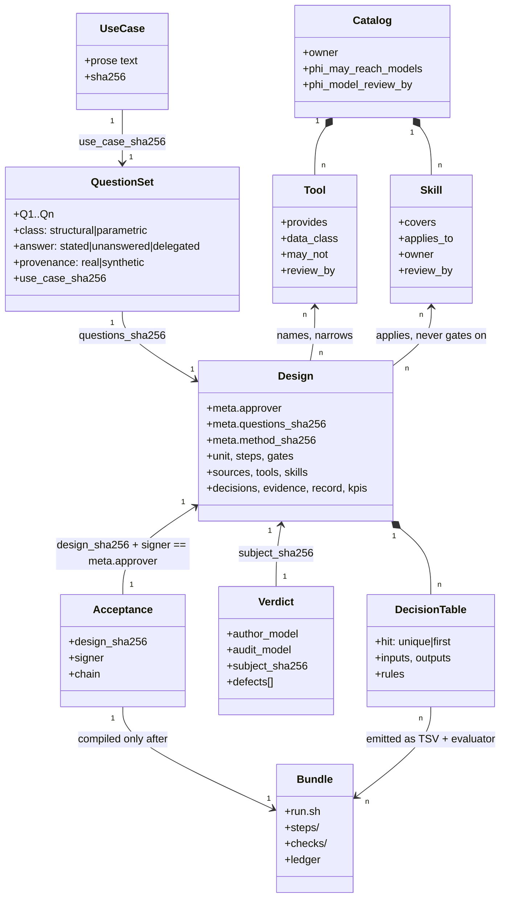
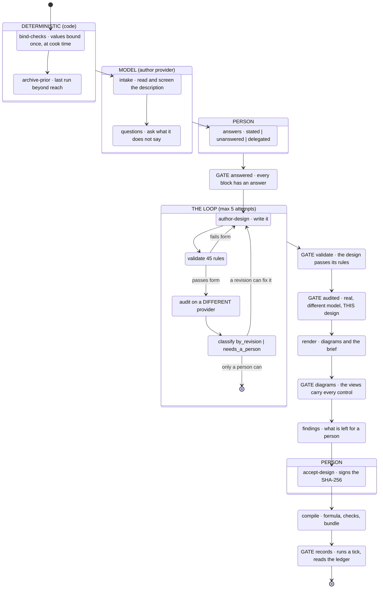
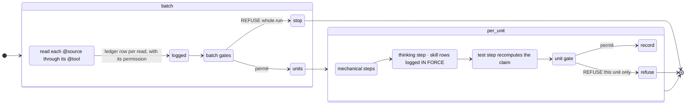
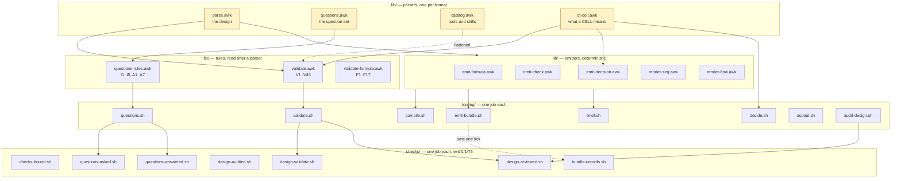
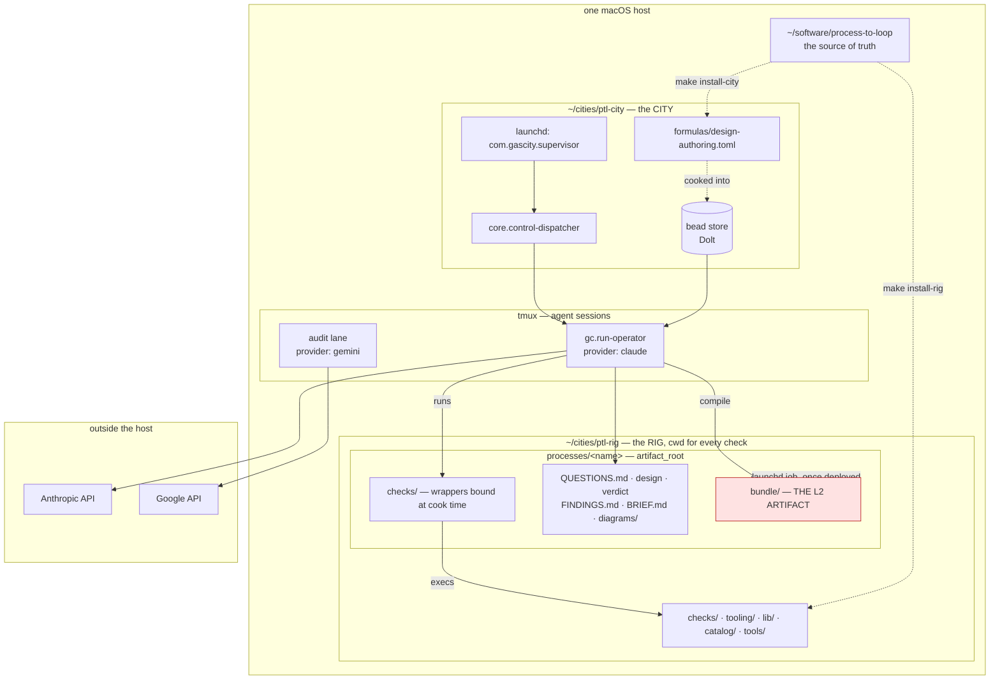
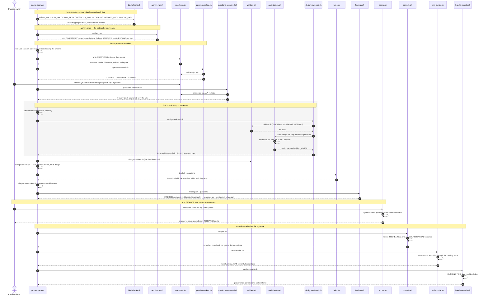
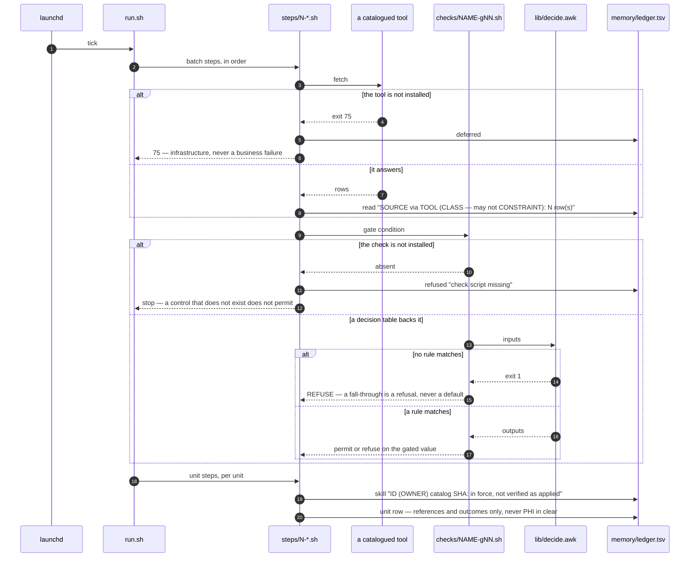

# Architecture: the 4+1 views

Kruchten's 4+1 model, applied to `process-to-loop`. Written 2026-10-09.

Every diagram below is also rendered beside this file, so it can be read without a toolchain:
`logical.svg`, `process-L1.svg`, `process-L2.svg`, `development.svg`, `physical.svg`,
`scenario-L1-scripts.svg`, `scenario-L2-tick.svg`. All seven are verified to render — a diagram
that does not compile is a diagram nobody checked.

Five views, each answering a different stakeholder's question:

| view | answers | for |
|---|---|---|
| **Logical** | what are the things, and how do they relate | the design owner |
| **Process** | what runs, when, and what blocks what | the operator |
| **Development** | what is the code organised into | whoever maintains it |
| **Physical** | what is deployed where | whoever stands it up |
| **+1 Scenarios** | what actually happens, script by script | all of them |

**The distinction this architecture turns on** is the one in
`loop-engineering-in-a-regulated-space.md`: **L1**, the design loop, is a development tool. **L2**,
the emitted bundle, is the regulated artifact. L1's entire job is to make L2 provable. Every view
below marks which one it is describing.

---

## 1. Logical view — the artifacts and what binds them

What exists, and which binding holds each pair together. Every edge labelled `sha256` is a
content binding, not a filename reference: change the content and the binding breaks.

**The rule this view encodes:** nothing downstream refers to anything upstream by *name*. Every
binding is a digest, so a change anywhere breaks the chain visibly rather than silently.

---

## 2. Process view — what runs and what blocks

**L1.** Seventeen steps, seven of them gates, two held by a person. Swimlanes are who executes.

**L2.** One tick of the emitted bundle. Batch steps once, unit steps per unit.

**The exit-code contract, which both levels honour:**

| | |
|---|---|
| `0` | the condition does not hold; work continues |
| `1` | refused — a business outcome, and the refusal names the next human action |
| `75` | could not run — infrastructure. **Never** a business failure, and costs no attempt |

---

## 3. Development view — how the code is organised

**The constraint this view exists to show:** `dt-cell.awk` is loaded by the validator **and**
copied into every emitted bundle. One definition of what a cell means. Two copies would be two
dialects of the same table, and the first divergence would sit between the rules that passed a
design and the check that enforces it.

---

## 4. Physical view — what is deployed where

**Two facts this view exists to record**, both of which cost hours to learn:

- a check's **cwd is the rig**, not the city. Checks installed only in the city are never found.
- inside an agent, **`$HOME` is the city directory**. A keychain lookup resolving `~` finds
  `cities/ptl-city/Library/Keychains`, which does not exist.

---

## 5. +1 Scenarios — the tooling scripts in sequence

The scenario that ties the other four together: **one described process becomes a running
bundle.** Every lifeline is a real script.

### The same scenario at L2 — one tick

---

## What the views disagree about, and why that is deliberate

The **logical** view shows a clean chain of digests. The **process** view shows a loop that can
fail at seven places. The **development** view shows one shared definition (`dt-cell.awk`) that
deliberately crosses the L1/L2 boundary. The **physical** view shows that a check's cwd and an
agent's `$HOME` are not what anybody assumes.

Those tensions are the architecture. The chain is clean *because* the loop refuses; the shared
definition crosses the boundary *so that* the rules and the emitted check cannot diverge; and the
cwd facts are recorded *because* every expensive defect in this project lived exactly there.
